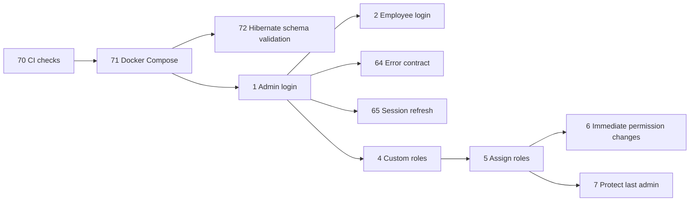
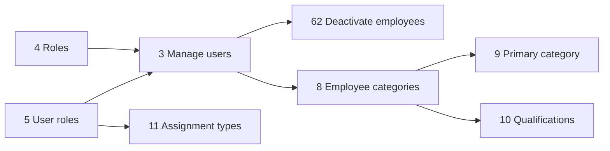
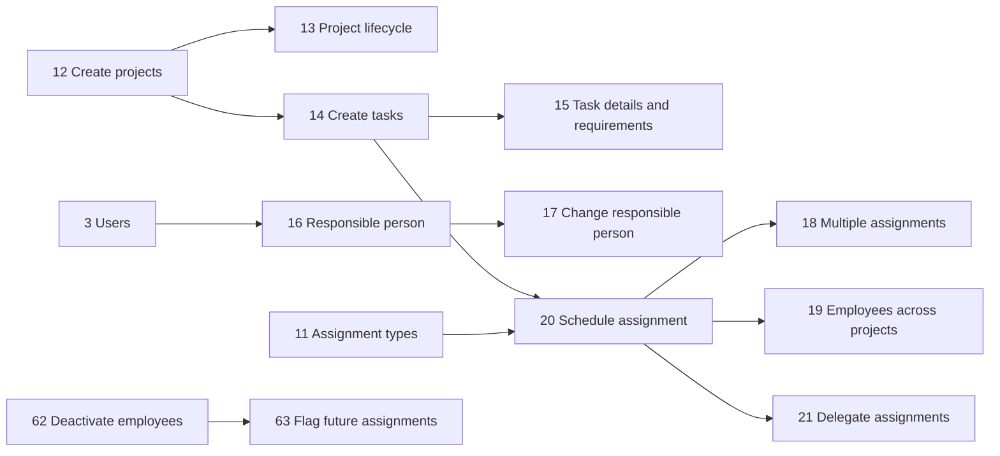
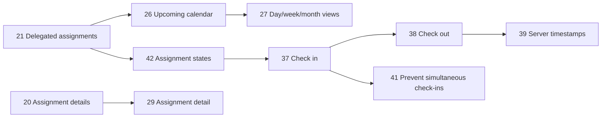
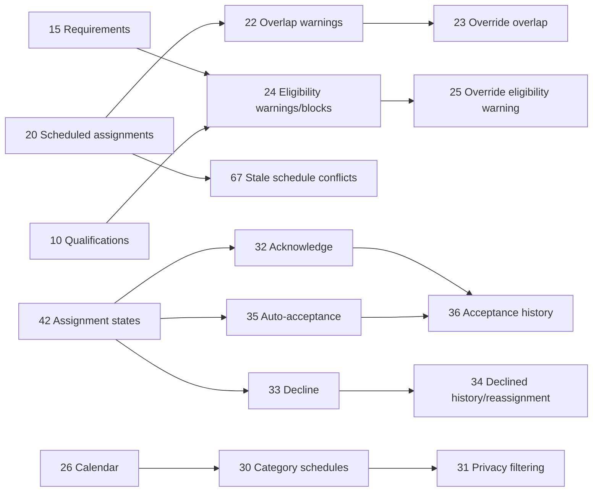
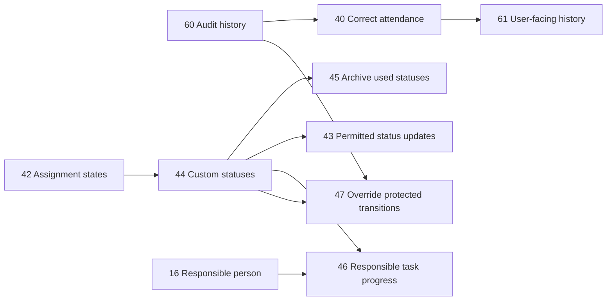
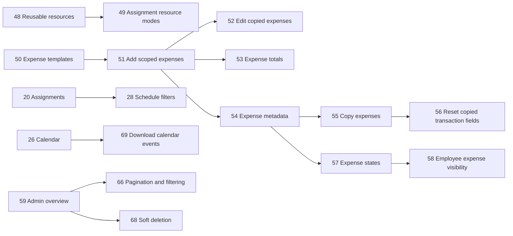
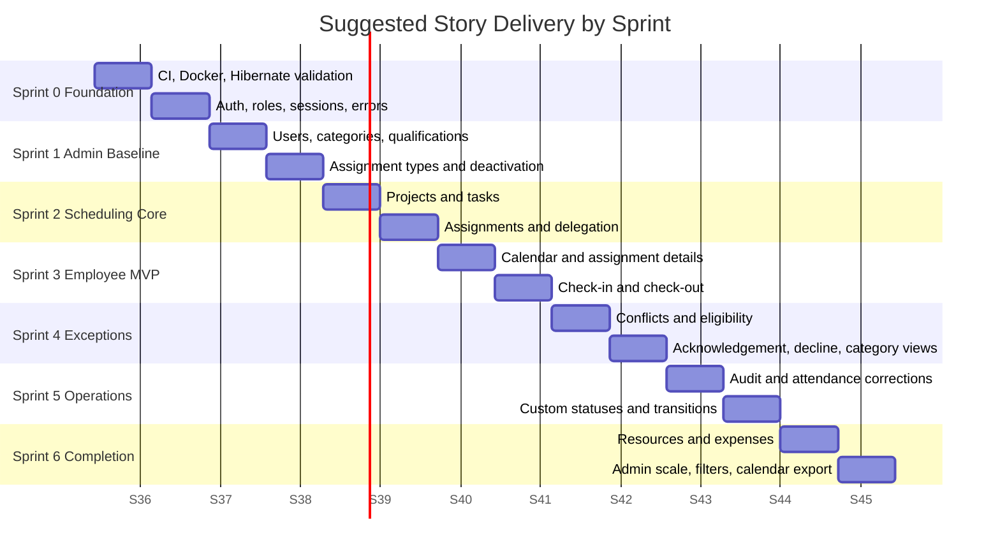
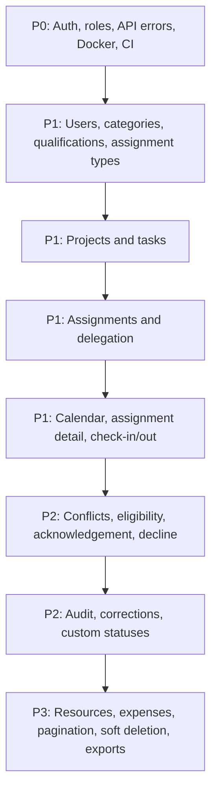

# User Story Priority and Blockers

Source: `spec.md`

This document ranks the user stories by delivery priority and identifies what blocks each group of work. The ranking favors vertical slices that make later stories possible: authentication first, then core administration, then project/task/assignment scheduling, then employee execution, then advanced workflow, expenses, audit/reporting, and operational hardening.

## Priority Scale

- **P0 Foundation**: Required before most product work can function or be tested credibly.
- **P1 Core MVP**: Required for the main demo path: admin creates work, employee sees it, employee performs it.
- **P2 Operational Completeness**: Required for realistic scheduling, accountability, and exception handling.
- **P3 Production Hardening**: Required for scale, reliability, traceability, and deployment confidence.
- **P4 Later Enhancement**: Useful but not required for the first credible release.

## Ranked User Stories

| Rank | Priority | Stories | Theme | Blocking Dependencies |
| ---: | --- | --- | --- | --- |
| 1 | P0 Foundation | 1, 2, 64, 65 | Login, sessions, user-facing errors | Backend/API scaffold, user model, role model, frontend auth flow |
| 2 | P0 Foundation | 4, 5, 6, 7 | Roles, permissions, immediate access revocation, protected last admin | Auth, user model, permission catalogue, token-version/session invalidation |
| 3 | P0 Foundation | 70, 71, 72 | CI, Docker Compose, PostgreSQL/Hibernate validation | Project scaffold, backend/frontend build commands, database configuration |
| 4 | P1 Core MVP | 3, 62, 63 | User lifecycle and deactivation rules | Auth, roles, audit baseline, assignment model for future assignment review |
| 5 | P1 Core MVP | 8, 9, 10 | Employee categories and qualifications | User administration, role-protected admin screens/API |
| 6 | P1 Core MVP | 11 | Assignment types | Admin authorization, persistence model |
| 7 | P1 Core MVP | 12, 13 | Project creation and lifecycle states | Auth, admin roles, project persistence |
| 8 | P1 Core MVP | 14, 15, 16, 17 | Task creation, details, requirements, responsible person | Projects, users, categories/qualifications for requirements, audit baseline for ownership changes |
| 9 | P1 Core MVP | 18, 19, 20, 21 | Assignment creation, scheduling, delegation | Projects, tasks, users, assignment types, categories/qualifications |
| 10 | P1 Core MVP | 26, 27, 29 | Employee calendar and assignment detail | Assignments, auth, frontend calendar shell |
| 11 | P1 Core MVP | 37, 38, 39 | Check-in/check-out with server timestamps | Assignments, assignment states, auth, time handling |
| 12 | P2 Operational Completeness | 22, 23, 24, 25, 67 | Conflict detection, eligibility checks, override reasons, stale edit conflicts | Assignment scheduling, category/qualification requirements, audit events, optimistic concurrency |
| 13 | P2 Operational Completeness | 32, 33, 34, 35, 36 | Acknowledge, decline, auto-acceptance, reassignment history | Assignment lifecycle, notifications/audit baseline, scheduled time processing |
| 14 | P2 Operational Completeness | 41, 42, 43 | Assignment state model and permitted progress updates | Check-in/out, role permissions, status transition rules |
| 15 | P2 Operational Completeness | 30, 31 | Category colleague schedule visibility and privacy | Calendar, categories, assignment visibility rules, authorization filters |
| 16 | P2 Operational Completeness | 40, 60, 61 | Attendance corrections, audit history, user-facing history | Check-in/out, audit event model, admin authorization |
| 17 | P2 Operational Completeness | 44, 45, 46, 47 | Custom task/assignment statuses and protected transitions | Basic assignment/task states, permission model, audit events |
| 18 | P2 Operational Completeness | 48, 49 | Resources and assignment resource requirements | Assignments, tasks, admin resource management |
| 19 | P3 Production Hardening | 59, 66, 68 | Admin-wide visibility, pagination/filtering, soft deletion | All core entities, authorization, repository/query conventions |
| 20 | P3 Production Hardening | 28, 69 | Advanced schedule filtering and downloadable calendar events | Calendar, assignments, project/task/status metadata |
| 21 | P3 Production Hardening | 50, 51, 52, 53, 54, 55, 56, 57, 58 | Expense templates, entries, copying, approval states, permitted employee views | Projects, tasks, assignments, roles/permissions, decimal money handling |

## Story-Level Blockers

| Story | Priority | Blocked By | Notes |
| ---: | --- | --- | --- |
| 1 | P0 | Backend auth, user persistence, login UI | Admin login is the first access-control seam. |
| 2 | P0 | Backend auth, user persistence, login UI | Employee login shares the same auth foundation as admins. |
| 3 | P1 | Stories 1, 4, 5 | User management requires authenticated admins and role checks. |
| 4 | P0 | Story 1, permission catalogue | Roles must be in place before fine-grained admin features. |
| 5 | P0 | Stories 3, 4 | Users and roles must both exist. |
| 6 | P0 | Stories 1, 4, 5 | Requires token/session invalidation design. |
| 7 | P0 | Stories 3, 4, 5 | Protects administrative continuity. |
| 8 | P1 | Stories 1, 4, 5 | Categories are admin-managed reference data. |
| 9 | P1 | Stories 3, 8 | Employees and categories must exist. |
| 10 | P1 | Stories 3, 8 | Qualifications depend on employee records and category/requirement concepts. |
| 11 | P1 | Stories 1, 4, 5 | Assignment type is scheduling reference data. |
| 12 | P1 | Stories 1, 4, 5 | Project creation needs admin authorization. |
| 13 | P1 | Story 12 | Lifecycle states attach to projects. |
| 14 | P1 | Story 12 | Tasks live inside projects. |
| 15 | P1 | Stories 8, 10, 14 | Requirements depend on categories/qualifications and task details. |
| 16 | P1 | Stories 3, 14 | Responsible person must be a known user. |
| 17 | P1 | Stories 16, 60 | Ownership changes should preserve history. |
| 18 | P1 | Stories 14, 20 | Multiple assignments require the assignment model. |
| 19 | P1 | Stories 3, 12, 20 | Cross-project scheduling needs employees, projects, and assignments. |
| 20 | P1 | Stories 11, 14 | Detailed assignments need tasks and assignment types. |
| 21 | P1 | Stories 3, 20 | Delegation requires assignable employees and scheduled assignments. |
| 22 | P2 | Stories 19, 20 | Overlap checks need assignment time ranges per employee. |
| 23 | P2 | Stories 22, 60 | Overrides require detected warnings and audit trail. |
| 24 | P2 | Stories 10, 15, 20 | Eligibility checks require requirements and employee qualifications. |
| 25 | P2 | Stories 24, 60 | Eligibility overrides require warnings/blocks and audit reasons. |
| 26 | P1 | Stories 20, 21 | Calendar needs delegated scheduled assignments. |
| 27 | P1 | Story 26 | View switching builds on base calendar data. |
| 28 | P3 | Stories 13, 20, 26, 42, 44 | Filters need schedule metadata and statuses. |
| 29 | P1 | Stories 15, 20, 48, 49 | Assignment detail depends on scheduled assignment content and resources where available. |
| 30 | P2 | Stories 8, 9, 20, 26 | Category views need employee categories and assignments. |
| 31 | P2 | Story 30 | Privacy filtering is layered onto category schedule visibility. |
| 32 | P2 | Stories 21, 42 | Acknowledgement changes assignment state. |
| 33 | P2 | Stories 21, 42 | Decline requires assignment lifecycle and reason capture. |
| 34 | P2 | Stories 33, 60 | Declined assignment history requires audit/history persistence. |
| 35 | P2 | Stories 20, 42 | Auto-acceptance needs scheduled start time and assignment states. |
| 36 | P2 | Stories 32, 35, 60 | Distinguishing explicit and automatic acceptance requires history/audit. |
| 37 | P1 | Stories 20, 21, 42 | Check-in requires valid delegated assignments and lifecycle states. |
| 38 | P1 | Story 37 | Check-out requires an active check-in. |
| 39 | P1 | Stories 37, 38 | Server timestamp authority is part of attendance persistence. |
| 40 | P2 | Stories 37, 38, 60 | Corrections require original attendance records and audit trail. |
| 41 | P2 | Stories 37, 42 | Simultaneous check-in prevention depends on active attendance state. |
| 42 | P2 | Stories 20, 32, 37 | Assignment states unify delegation, acknowledgement, and attendance. |
| 43 | P2 | Stories 42, 44 | Permitted updates need state rules and authorization. |
| 44 | P2 | Stories 14, 20, 42 | Custom statuses attach to tasks and assignments. |
| 45 | P2 | Story 44 | Status archive rules depend on status definitions. |
| 46 | P2 | Stories 16, 44 | Responsible person updates require ownership and task statuses. |
| 47 | P2 | Stories 44, 60 | Protected transition overrides require status rules and audit. |
| 48 | P2 | Stories 1, 4, 5 | Resources are admin-managed reference data. |
| 49 | P2 | Stories 20, 48 | Assignment resource usage depends on resources and assignments. |
| 50 | P3 | Stories 1, 4, 5 | Expense templates are admin-managed reference data. |
| 51 | P3 | Stories 12, 14, 20, 50 | Expenses attach to project/task/assignment scopes. |
| 52 | P3 | Stories 51, 55 | Editing copied expenses depends on copying behavior. |
| 53 | P3 | Story 51 | Totals require expense entry model and decimal handling. |
| 54 | P3 | Story 51 | Expense metadata extends the expense entry model. |
| 55 | P3 | Stories 51, 54 | Copying requires compatible source and target expense scopes. |
| 56 | P3 | Story 55 | Reset behavior is part of copying semantics. |
| 57 | P3 | Stories 51, 54 | Expense states build on the expense model. |
| 58 | P3 | Stories 29, 51, 57 | Employee expense visibility requires assignments and authorization. |
| 59 | P3 | Core entity stories 3, 8, 12, 14, 20, 48, 51, 60 | Admin overview depends on the entities it displays. |
| 60 | P2 | Auth, core persistence, event model | Audit history should begin early and expand with each workflow. |
| 61 | P2 | Stories 37, 40, 60 | User-facing history depends on attendance and correction events. |
| 62 | P1 | Story 3 | Deactivation is part of user lifecycle. |
| 63 | P1 | Stories 20, 62 | Future assignment review needs assignments and deactivation. |
| 64 | P0 | API error contract, frontend API client | Used across all flows. |
| 65 | P0 | Stories 1, 2, 6 | Refresh behavior depends on auth/session strategy. |
| 66 | P3 | Repository/query conventions, core entity lists | Pagination/filtering applies after collections exist. |
| 67 | P2 | Stories 20, 22 | Concurrency conflicts require schedule editing and version checks. |
| 68 | P3 | Core entities, audit/history decisions | Soft deletion matters once records have operational history. |
| 69 | P3 | Stories 20, 26 | Calendar export depends on schedule data. |
| 70 | P0 | Project scaffold | CI should be introduced as soon as build/test commands exist. |
| 71 | P0 | Backend/frontend scaffold, database configuration | Local services are needed for development and tests. |
| 72 | P0 | Hibernate configuration, production database connection strategy | Prevents accidental production schema mutation. |

## Sprint Plan

### Sprint 0: Technical Foundation

Goal: make the system buildable, runnable, testable, and securable.

### Sprint 1: Administration Baseline

Goal: create the administrative reference data needed before work can be scheduled.

### Sprint 2: Project, Task, and Assignment Core

Goal: enable an administrator to create project work and delegate scheduled assignments.

### Sprint 3: Employee Schedule and Attendance MVP

Goal: let an employee see delegated work and perform the basic attendance flow.

### Sprint 4: Scheduling Exceptions and Collaboration

Goal: handle realistic scheduling conflicts, employee responses, and category visibility.

### Sprint 5: Audit, Statuses, and Operational Control

Goal: make changes traceable and make progress/status workflows configurable.

### Sprint 6: Resources, Expenses, and Admin Scale

Goal: complete supporting operational context and make growing data manageable.

## Sprint-Based Delivery Diagram

## Critical Path

## MVP Cut Line

For a credible first release/demo, complete through **Sprint 3** and include the minimal audit hooks needed for later history. This gives the team authenticated access, admin setup, project/task/assignment creation, employee calendar visibility, and check-in/check-out.

The first production-shaped release should complete through **Sprint 5**, because conflict handling, employee responses, audit history, and status transitions are needed for realistic operational use.

Sprint 6 contains important scope, but it is less blocking for the core scheduling workflow unless expenses are required for the demo narrative.
